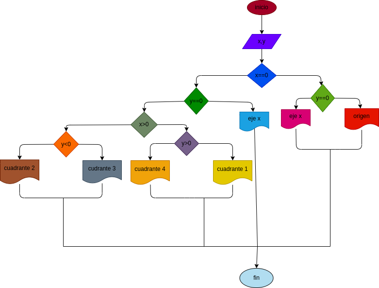

# EJercicio No.1

## Programa que lea las coordenadas cartesianas (x, y) de un punto en el plano y calcule el cuadrante al cual pertenece el punto. Si el punto está sobre un eje también debe indicarlo.

# ANALISIS

Variabes de entrada (input)

X: es el valor de X en la coordenada
Y: es el valor de Y en la coordenada 

Variables de proceso y salida (precessing, storage, output)

origen: es cuando X y Y son 0
eje X: es cuando X es 0
eje Y: es cuando Y es 0
1: es cuando X y Y son positivas 
2: es cuando X es negativa y Y es positiva
3: es cuando X y Y sin negativas 
4: es cuando X es positiva y Y es negativa 

# DISEÑO

# CONSTRUCCION