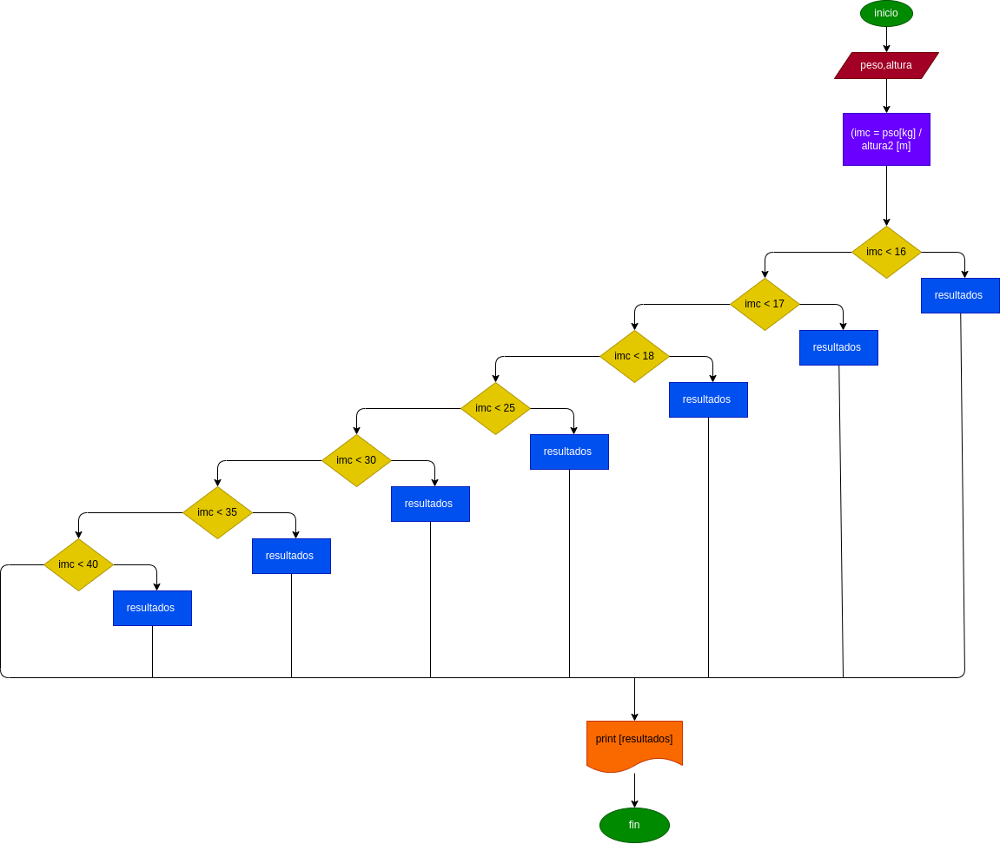

## masa corporal 
programa para saber su masa corporal de acuerdo a su peso y altura 
# ANALISIS 

--variables de entrda 

peso = su peso ingresado 
altura = su altura ingresada 

-- variables de proceso 

resultados = son los resultados de su indice de peso 

-- variables de salida 

imc y resultados sultan su indice de peso y el resultado de estos 
--
# DISEÑO 

# CONSTRUCCION 