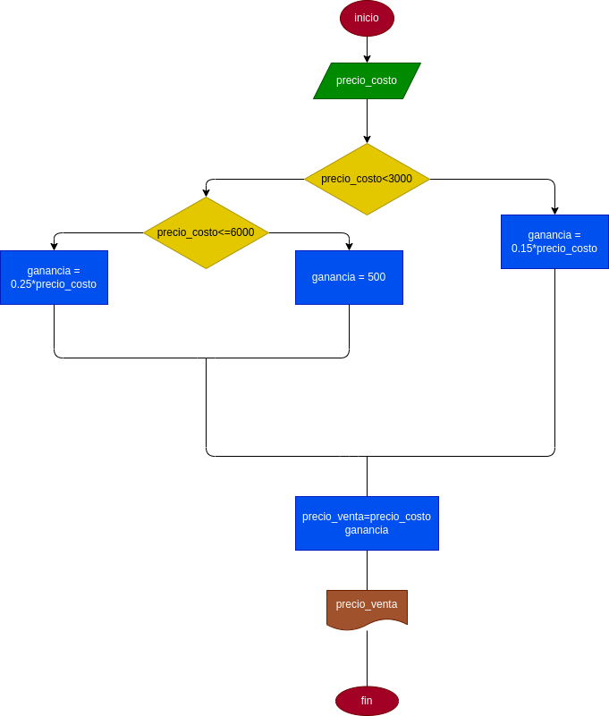

## PRECIO EN UNA PAPELERIA 
programa para saber el precio adecuado de venta en una papeleria de diferenes product segun su precio 
# ANALISIS

--variable de entrada 

precio_costo = la variable del precio al q compramos el producto 

--vaiable de proceso 
ganancia = es el precio de costo por el porcentaje necesario de acuerdo al precio 
precio_venta = (ganancia + precio_costo) 
--variable de salida

precio_venta = es el precio obtimo para vender el producto 

# DISEÑO

# CONSTRUCCION
